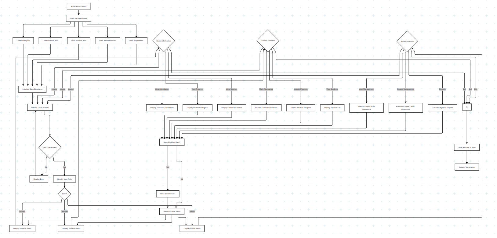
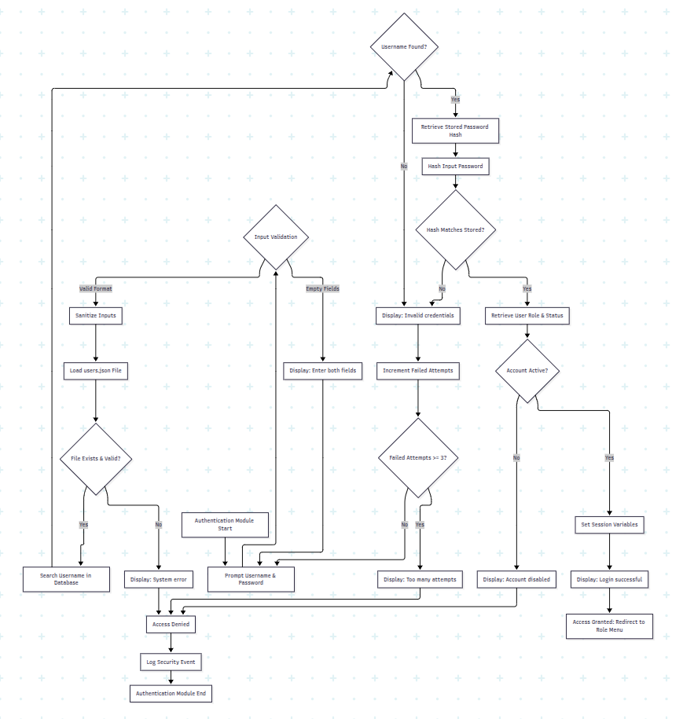
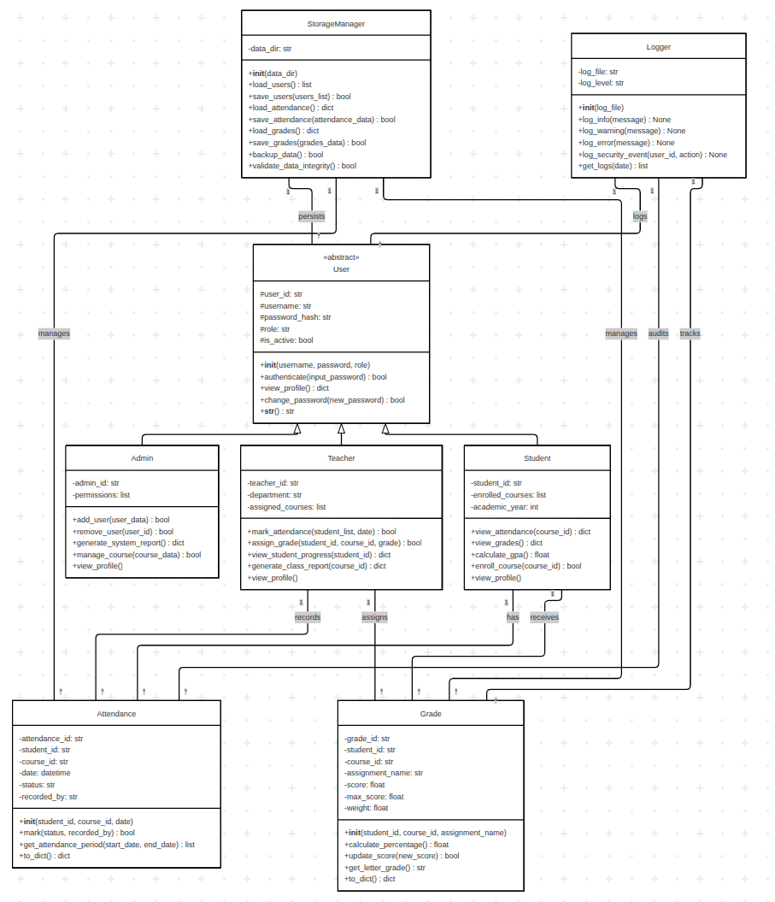
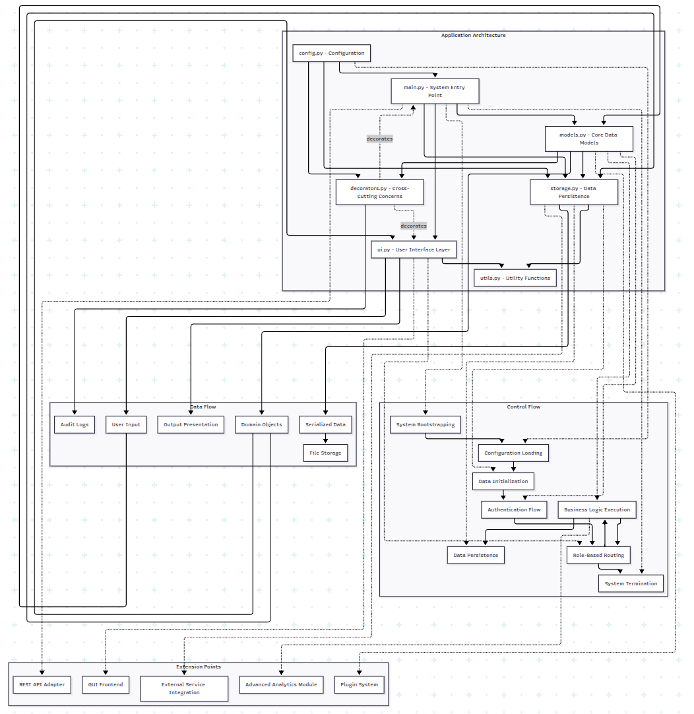

# Student Progress and Attendance Management System (Python CLI)
## Assignment Report

### 1. Introduction
This report documents the design and implementation of a console-based **Student Progress and Attendance Management System**. The system is designed to help educational institutions (Admins, Teachers, and Students) manage user data, course attendance, and academic performance efficiently. The project emphasizes modular Object-Oriented Programming (OOP) principles, separation of concerns, and robust error handling without relying on external databases or web frameworks.

### 2. System Overview
The application operates as a Command Line Interface (CLI) tool. It provides a persistent state using file-based storage (JSON and CSV) and enforces role-based access control.

*   **Entry Point**: `main.py` serves as the central orchestrator, managing the application lifecycle from initialization to graceful shutdown.
*   **Interaction**: Users interact via text-based menus and typed inputs, handled by a dedicated UI layer (`ui/`).
*   **Data Persistence**: All data is saved to a local `data/` directory, ensuring information is retained between sessions.
*   **ErrorReporting**: The system includes a comprehensive reporting module that generates human-readable text and CSV files for attendance and grade analytics.

### 3. System Diagrams
This section depicts the visual models representing the system's architecture, data flow, and control logic.

*Figure 1: High-level architectural overview illustrating the interaction between the User Interface layer, the core Business Logic Controller, and the Data Persistence layer.*

*Figure 2: Sequence diagram detailing the authentication process, verifying user credentials against the persistent JSON storage and establishing the user session.*

*Figure 3: Role-Based Access Control diagram demonstrating the enforcement of specific permissions and menu availability for Admin, Teacher, and Student roles.*

*Figure 4: Data persistence schema distinguishing between structured JSON user data and tabular CSV academic records used for attendance and grades.*

*Figure 5: Activity diagram depicting the reporting module's data aggregation pipeline, from fetching raw attendance logs to generating statistical performance summaries.*

*Figure 6: Control flow diagram mapping the application lifecycle, from initialization and integrity checks in `main.py` through the event loop and graceful termination.*

### 4. Architecture & Design
The system follows a layered architecture to ensure maintainability and scalability, matching the provided system, class, and sequence diagrams.

*   **Presentation Layer (UI)**:
    *   `ui/prompts.py`: Handles all user input, validation, and output display. It keeps the core logic clean of `input()`/`print()` calls (mostly).
    *   `ui/menus.py`: Defines the menu options available for each user role, returning standardized action keys to the controller.
*   **Business Logic Layer (Controller/Models)**:
    *   `main.py`: Acts as the main controller. It integrates authentication, routes actions based on roles, and calls the appropriate model or storage methods.
    *   `models/`: Contains the core business objects.
        *   `User` (Abstract Base Class): Defines generic properties like username, password hash, and role.
        *   `Admin`, `Teacher`, `Student`: Concretions of `User` with role-specific methods (e.g., `mark_attendance` for Teachers).
        *   `Attendance`, `Grade`: Data classes representing records.
*   **Data Access Layer (Storage)**:
    *   `storage/storage_manager.py`: Centralizes all file I/O operations. It insulates the rest of the application from the details of how data is stored (JSON vs CSV).
*   **Cross-Cutting Concerns**:
    *   `utils.py`: Contains shared logic for date validation, GPA calculation, and report generation.
    *   `decorators/`: Includes `auth.py` and `logger.py` for reusable security and logging components (infrastructure ready).

### 5. OOP & Modular Design
The project strictly adheres to OOP principles:
*   **Encapsulation**: Attributes in `User` and its subclasses are protected (e.g., `_username`, `_role`) or private, exposed only through methods or strictly controlled access.
*   **Inheritance**: The user hierarchy (`User` -> `Admin`, `Teacher`, `Student`) allows for shared authentication logic while implementing polymorphic behavior for profile viewing.
*   **Abstraction**: `User` is an abstract base class, preventing direct instantiation of generic users and enforcing the implementation of `view_profile` in subclasses.
*   **Polymorphism**: The system can treat different user types uniformly where appropriate (e.g., during login validation).

### 6. Data Storage & Validation
Data is managed via `StorageManager` to ensure integrity and persistence.
*   **Users**: Stored in `data/users.json`. The manager handles JSON serialization/deserialization.
*   **Attendance**: Stored in `data/attendance.csv`.
*   **Grades**: Stored in `data/grades.csv`.
*   **Validation**:
    *   **Input**: `ui/prompts.py` uses helper functions to normalize strings and validate types (e.g., ensuring scores are non-negative floats).
    *   **Data Integrity**: On startup, `StorageManager.validate_data_integrity()` checks if the storage files are corrupted, preventing a crash during runtime.
    *   **Backups**: A `backup_data()` method creates timestamped copies of data files upon exit or critical failures.

### 7. User Roles & Security
Security is enforced at multiple levels:
*   **Authentication**: Users must provide a valid username and matching password. The system checks `_password_hash` (simulated as plain text for this prototype as per requirements, but architected for hashing).
*   **Access Control**: The application loop in `main.py` strictly routes users to their specific menus (`admin_menu`, `teacher_menu`, `student_menu`) based on the `_role` attribute loaded from storage.
*   **Account Status**: Inactive accounts (`_is_active=False`) are denied login access.

### 8. Testing & Edge Cases
The implementation addresses several key edge cases:
*   **Missing Files**: `StorageManager` degrades gracefully, returning empty lists instead of crashing if files don't exist.
*   **Corrupt Data**: The integrity check at boot prevents the system from running on bad data.
*   **Invalid Input**: Prompts loop until valid input is received (e.g., non-empty strings, valid dates).
*   **Concurrency**: While single-threaded, the system is designed to load data fresh before operations to minimize stale state issues in a file-based environment.
*   **Interruption**: `KeyboardInterrupt` (Ctrl+C) is caught in `main.py` to ensure data backing up and a clean exit.

### 9. Limitations & Future Improvements
*   **Scalability**: File-based storage is not suitable for high concurrency or massive datasets. A migration to SQL (SQLite/PostgreSQL) would be the next logical step.
*   **Concurrency**: The current CLI is single-user. A web-based API (FastAPI) would allow multiple users to interact simultaneously.
*   **Hashing**: Password hashing is currently mocked for simplicity. Integrating `bcrypt` or `hashlib` is required for production security.
*   **UI Experience**: While functional, a text-based UI is limited. A web frontend or GUI would improve usability.
